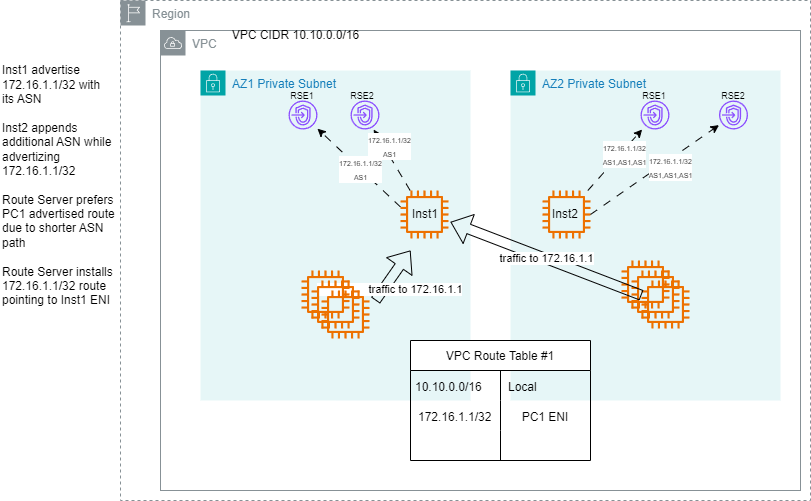

# Sample VPC Route Server Deployment

This repository contains a sample AWS CloudFormation template that demonstrates how to deploy [Amazon VPC Route Server](https://docs.aws.amazon.com/vpc/latest/userguide/dynamic-routing-route-server.html) with BGP-based inter-Availability Zone failover using a floating IP.

This repository accompanies the AWS blog post [Dynamic routing using Amazon VPC Route Server](https://aws.amazon.com/blogs/networking-and-content-delivery/dynamic-routing-using-amazon-vpc-route-server/).

## Overview

Amazon VPC Route Server provides dynamic routing capabilities within your VPC using the BGP routing protocol. Many network functions — firewalls, deep packet inspection (DPI) appliances, 5G core, and others — use BGP to influence routing and achieve high availability and failover between clusters.

Amazon VPC Route Server can dynamically update VPC and internet gateway (IGW) route tables with preferred IPv4 or IPv6 routes to achieve routing fault tolerance for workloads. When a failure occurs, the system automatically reroutes traffic within the VPC, enhancing the manageability of VPC routing and improving interoperability with third-party workloads.

## Use Case: Floating IP for Inter-AZ Failover

This solution demonstrates an application deployed across two Availability Zones that uses a floating IP (172.16.1.1/32) for service reachability. BGP routing handles failover between active and standby nodes automatically.



In the diagram above:

- Instances `instance-rs-az1` (active) and `instance-rs-az2` (standby) are deployed in different AZs within an Amazon VPC.
- VPC Route Server endpoints are deployed in the same subnets and have reachability to both instances.
- Both instances establish eBGP sessions with VPC Route Server endpoints and advertise 172.16.1.1/32.
- The standby instance (`instance-rs-az2`) appends additional ASNs to the AS Path, making BGP prefer the active instance's shorter path.
- Amazon VPC Route Server calculates the next hop for 172.16.1.1/32 using BGP path selection rules and programs the route table to point to the ENI of the preferred instance.

## What the CloudFormation Template Creates

The template (`RS_CF.yaml`) deploys the following resources:

- A VPC with three subnets across two Availability Zones
- A VPC route table associated with all three subnets
- An internet gateway attached to the VPC with a default route
- An Amazon VPC Route Server (ASN 65000) associated with the VPC
- Two VPC Route Server endpoints in each subnet (for high availability)
- Route Server peers for BGP session establishment
- Two Amazon EC2 instances simulating an HA application, each running GoBGP with ASN 65001
- GoBGP configurations pre-loaded via instance user-data (stored in `/home/ec2-user/gobgpd.conf`)
- A test instance for connectivity verification
- An AWS Identity and Access Management (IAM) role for AWS Systems Manager access

## Prerequisites

- Familiarity with BGP routing concepts and high-availability architectures
- Experience with AWS networking services, including Amazon VPC, route tables, and elastic network interfaces
- AWS CLI installed and configured, or access to the AWS Management Console
- Basic knowledge of AWS CloudFormation

> **Important:** This walkthrough creates AWS resources that incur costs, including Amazon EC2 instances and Amazon VPC Route Server endpoints. Remember to delete all resources after testing to avoid ongoing charges.

## Deployment

### Option 1: AWS Management Console

1. Sign in to the AWS CloudFormation console.
2. Choose **Create stack**.
3. Choose **With new resources (standard)**.
4. For Template source, choose **Upload a template file**.
5. Choose **Choose file**.
6. Select the `RS_CF.yaml` template file.
7. Choose **Next**.
8. For Stack name, enter a name such as `route-server-demo`.
9. Choose **Next** on each remaining configuration page, accepting the default values.
10. Choose **Submit**.

### Option 2: AWS CLI

```bash
aws cloudformation create-stack \
  --stack-name route-server-demo \
  --template-body file://RS_CF.yaml \
  --capabilities CAPABILITY_IAM
```

## Walkthrough

### Verify BGP Peering

Access the instances using Session Manager, a capability of AWS Systems Manager. Connect to one of the instances (`instance-rs-az1` or `instance-rs-az2`).

Inspect the GoBGP configuration:

```
sh-5.2$ sudo more /home/ec2-user/gobgpd.conf
[global.config]
as = 65001
router-id = "10.0.1.203"
[[neighbors]]
  [neighbors.config]
    neighbor-address = "10.0.1.230"
    peer-as = 65000
  [[neighbors.afi-safis]]
    [neighbors.afi-safis.config]
      afi-safi-name = "ipv4-unicast"

[[neighbors]]
  [neighbors.config]
    neighbor-address = "10.0.1.136"
    peer-as = 65000
  [[neighbors.afi-safis]]
    [neighbors.afi-safis.config]
      afi-safi-name = "ipv4-unicast"
```

> **Note:** The neighbor IP addresses will vary depending on the actual Route Server endpoint addresses in your deployment.

Check the BGP neighbor state — there should be two neighbors representing the two VPC Route Server endpoints in the instance subnet:

```
sh-5.2$ sudo /home/ec2-user/gobgp neighbor
Peer          AS  Up/Down State        |#Received  Accepted
10.0.1.136 65000 22:43:07 Establ       |        0         0
10.0.1.230 65000 22:43:08 Establ       |        0         0
```

Verify the loopback route is being advertised through BGP:

```
sh-5.2$ sudo /home/ec2-user/gobgp global rib
   Network              Next Hop             AS_PATH              Age        Attrs
*> 172.16.1.1/32        0.0.0.0                                   22:42:21   [{Origin: ?}]
```

### Test Connectivity

From the test instance (`test-instance`), ping the floating IP:

```
sh-5.2$ ping 172.16.1.1
PING 172.16.1.1 (172.16.1.1) 56(84) bytes of data.
64 bytes from 172.16.1.1: icmp_seq=1 ttl=127 time=0.712 ms
64 bytes from 172.16.1.1: icmp_seq=2 ttl=127 time=0.338 ms
64 bytes from 172.16.1.1: icmp_seq=3 ttl=127 time=0.378 ms
```

### Test Failover

To simulate a failover, stop the active instance (`instance-rs-az1`):

1. BGP detects the failure within the configured keepalive timeout.
2. Amazon VPC Route Server marks the BGP session as down and withdraws the route.
3. BGP reconvergence selects the standby instance's route as the best path.
4. The VPC route table updates to forward traffic for 172.16.1.1/32 to the standby instance ENI.
5. Traffic seamlessly transitions to the standby instance.

Ping from the test instance confirms traffic now flows through `instance-rs-az2`:

```
sh-5.2$ ping 172.16.1.1
PING 172.16.1.1 (172.16.1.1) 56(84) bytes of data.
64 bytes from 172.16.1.1: icmp_seq=1 ttl=127 time=0.712 ms
64 bytes from 172.16.1.1: icmp_seq=2 ttl=127 time=0.338 ms
64 bytes from 172.16.1.1: icmp_seq=3 ttl=127 time=0.378 ms
```

To enable faster failure detection, Bidirectional Forwarding Detection (BFD) can be enabled between the application instances and the Route Server endpoints. BFD significantly reduces the time needed to detect link or application failure.

## Related Resources

- [Dynamic routing using Amazon VPC Route Server](https://aws.amazon.com/blogs/networking-and-content-delivery/dynamic-routing-using-amazon-vpc-route-server/) — companion blog post
- [Amazon VPC Route Server documentation](https://docs.aws.amazon.com/vpc/latest/userguide/dynamic-routing-route-server.html)

## Cleanup

To avoid ongoing charges, delete the CloudFormation stack:

1. Open the AWS CloudFormation console.
2. Select the stack (e.g., `route-server-demo`).
3. Choose **Delete**.
4. Confirm the deletion when prompted.

> **Note:** If stack deletion fails, retry with the **Force delete this entire stack** option to remove any retained resources.

## Security

See [CONTRIBUTING](CONTRIBUTING.md#security-issue-notifications) for more information.

## License

This library is licensed under the MIT-0 License. See the [LICENSE](LICENSE) file.
