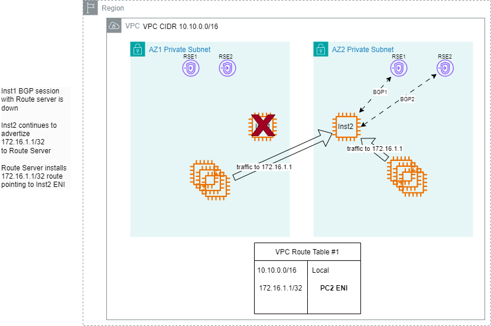

# Sample VPC Route Server Deployement 

## Introduction

VPC Route Server provides dynamic routing capabilities within VPC by using the BGP routing protocol. Many existing network functions ( firewalls, DPIs , 5G core , etc.) utilize BGP to influence routing and achieve high avialability and failover in between clusters. VPC Route Server can dynamically update VPC and IGW route tables with preferred IPv4 or IPv6 routes to achieve routing fault tolerance for workloads. When a failure occurs, the system can automatically reroute traffic within the VPC, which enhances the manageability of VPC routing and improves interoperability with third-party workloads. 

## Using floating IP for Inter AZ failover
The use case we will be testing is for an application that is deployed across 2 availability zones. The application utilizes a floating IP for reachiability to the service offered. We will use BGP routing to failover traffic between active and standby nodes that are deployed across different avaialbility zones.

In the diagram below, instances Inst1 and Inst2 are deployed in different AZs (AZ1 and AZ2) in AWS VPC. VPC route server endpoints are deployed in the same subnets as the FW and has reachability to both FWs. 

Both Instance would  have eBGP sessions with VPC route server endpoints. both Inst1 and Inst2 is advertizing 172.16.1.1/32 over BGP to VPC route server. Inst2 is appending additional ASNs to the AS PATH. The gateway calcualtes the next hop infomation for 172.16.1.1/32 using BGP  prefixes and then programs the routing table associated with that subnet to point to the ENI that owns the next hop IP as advertized in BGP.


## Clouformation to deploy the solution

The [CloudFormation](RS_CF.yaml) in this repo will deploy the solution in your AWS account. The CloudFormation creates the following reousrces:

-VPC with three subnets across two AZs 
-VPC route table for the three subnets created
-Create and attach IGW to VPC and create a default route to IGW in VPC route table
-Create and attach route server to VPC—the route server uses ASN 65000
-Create two VPC Route Server endpoints (RSEs) in each subnet (for high availability) 
-Create route server peers
-Create two instances to simulate the HA application under test. 
-Gobgp is used to run BGP on each instance. 
-Each instance is running BGP using ASN 65001 and peers with RSEs in their prospective subnets
-Gobgp configurations are preconfigured as part of the user-data of the instances and are stored in gobgpd.conf file in the /home/ec2-user directory 
-Create a test instance to ping the loopback IP of the high availability application under test
-AWS Systems Manager can be used to access the instances created

You can use AWS CLI or AWS console to deploy the cloudforamtion. 

## Working Solution
Once Cloudformation is deployed successfully: 

1.	Both active and standby instances advertise 172.16.1.1/32 through BGP to both RSEs in their prospective subnets. 
2.	The VPC Route Server receives four advertisements for the same prefix. This is observed in Figure 4 where loopback 172.16.1.1/32 is received by four RSEs. 
3.	Using BGP path selection rules, it prefers the route from the active instance due to the shorter AS Path. This is shown in Figure 4 where one of the four paths is selected and installed.
4.	The VPC Route Server identifies the ENI associated with the active instance and updates the VPC route table to forward traffic for 172.16.1.1/32 to ENI-A that belongs with Inst1.


You can inspect the Gobgp configuration by connecting to one of the instances (instance-rs-az1 
 or instance-rs-az2) using EC2 Session Manager .

The Gobgp configuration is in /home/ec2-user/gobgpd.conf.


```shell
sh-5.2$ sudo more /home/ec2-user/gobgpd.conf
[global.config]
as = 65001
router-id = "10.0.1.203"
[[neighbors]]
  [neighbors.config]
    neighbor-address = "10.0.1.230"
    peer-as = 65000
  [[neighbors.afi-safis]]
    [neighbors.afi-safis.config]
      afi-safi-name = "ipv4-unicast"

[[neighbors]]
  [neighbors.config]
    neighbor-address = "10.0.1.136"
    peer-as = 65000
  [[neighbors.afi-safis]]
    [neighbors.afi-safis.config]
      afi-safi-name = "ipv4-unicast"
```

Use the following command to check the BGP neighbor state . There should be two neighbors representing the two VPC RSEs in the instance subnet.

```shell
sh-5.2$ sudo /home/ec2-user/gobgp neighbor
Peer          AS  Up/Down State       |#Received  Accepted
10.0.1.136 65000 22:43:07 Establ      |        0         0
10.0.1.230 65000 22:43:08 Establ      |        0         0 
```

Check that the loopback route is being advertised through BGP. 

```shell
sh-5.2$ sudo /home/ec2-user/gobgp global rib
   Network              Next Hop             AS_PATH              Age        Attrs
*> 172.16.1.1/32        0.0.0.0                                   22:42:21   [{Origin: ?}]
```

To test the routing setup , you can access the test instance “test-instance” using Systems Manager method. When you are logged in , you can ping 172.16.1.1 and you should get a reply that is originating from the active instance “instance-rs-az1”.

```shell
sh-5.2$ ping 172.16.1.1
PING 172.16.1.1 (172.16.1.1) 56(84) bytes of data.
64 bytes from 172.16.1.1: icmp_seq=1 ttl=127 time=0.712 ms
64 bytes from 172.16.1.1: icmp_seq=2 ttl=127 time=0.338 ms
64 bytes from 172.16.1.1: icmp_seq=3 ttl=127 time=0.378 ms
```

## Failover detection and recovery

To simulate a failover , you can shut down the active instance (instance-rs-az1).

1.	If the active instance fails or becomes unreachable, then BGP detects the failure within the configured timeout.
2.	The VPC Route Server marks the BGP session with the active instance as down and withdraws the route from the RIB table.
3.	A BGP re-convergence process is triggered, and the route advertised by the standby instance is now chosen as the best path.
4.	The VPC route table is updated to forward traffic for 172.16.1.1/32 to the ENI of the standby instance (ENI-B).
5.	Traffic seamlessly transitions to the standby instance, maintaining application availability without client disruption.




To test the routing setup, you can access the test instance “test-instance” using the Systems Manager method. When you are logged in, you can ping 172.16.1.1 and you should get a reply that is originating from the now active instance “instance-rs-az2”.

```shell
sh-5.2$ ping 172.16.1.1
PING 172.16.1.1 (172.16.1.1) 56(84) bytes of data.
64 bytes from 172.16.1.1: icmp_seq=1 ttl=127 time=0.712 ms
64 bytes from 172.16.1.1: icmp_seq=2 ttl=127 time=0.338 ms
64 bytes from 172.16.1.1: icmp_seq=3 ttl=127 time=0.378 ms
```

To make sure of the rapid detection of failure, the BFD protocol can be enabled between the application and the RSEs. BFD significantly reduces the time needed to detect link or application failure.

## Summary

This scenario demonstrates a robust method for implementing floating IP-based failover in AWS using standard routing protocols such as BGP and BFD. It enables fast, reliable, and transparent failover between AZs without needing DNS updates or manual intervention. This solution is ideal for high-availability workloads that need minimal downtime and maximum resiliency.
 


## Security

See [CONTRIBUTING](CONTRIBUTING.md#security-issue-notifications) for more information.

## License

This library is licensed under the MIT-0 License. See the LICENSE file.

